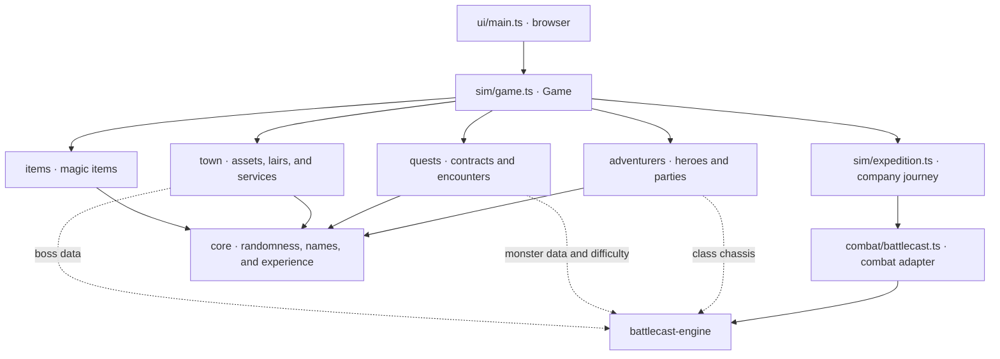

# Architecture and module interfaces

Reference for the current `src/` code (30 September 2026). Here, an **interface** includes both exported types and functions and the conditions callers must respect: state changes, side effects, ordering, results, and errors. For the design rationale and extension guide, see [Architecture](ARCHITECTURE.md).

## Architecture map

The arrows show the main dependencies. Domain modules also depend on each other: `adventurers` uses `items`; `quests` uses `town` and `items`; and `town` uses types and functions from `adventurers`, `items`, and `quests`. These references do not change who owns the state of a run.

`Game` owns the mutable world: town, parties, quests, lairs, statistics, clock, and event log. `step()` advances one hour. External consumers normally use `new Game(config)`, `step()`, `onEvent(listener)`, and `view()`. The UI displays a projection of the world and controls when the clock advances; it does not directly modify domain entities.

On each step, `Game` increments the clock and runs these operations in order: daily bookkeeping and lair respawn every 24 hours; shop restocking; raids; contract and assault posting; party arrivals; active party updates in descending renown order; and quest expiration. Each party follows `idle → traveling → questing → returning → resting → idle`, with `disbanded` when the party is lost. This order is part of reproducible behavior.

`Game` supplies the `battlecast-engine` adapter to the Expedition module, which runs fights through it. Some domain modules also read data or calculations from the engine to create heroes, encounters, and bosses. Combat execution itself stays in `combat/battlecast.ts`.

## Cross-cutting contracts

- **Randomness and identity.** `Game` creates one `Rng` for the world and passes it to factories. The order of random draws affects all subsequent simulation results. `rng.seed()` consumes one value for an independent combat. `rng.id(kind)` allocates sequential IDs by kind and by run without consuming randomness; interleaved runs keep separate ID sequences.
- **State ownership.** Factories return mutable entities, and domain functions may change them. `Game` coordinates status transitions, payments, rewards, and application of combat results. External readers use `view()`, which builds a fresh immutable snapshot. An internal `Quest` includes hidden encounters; its view exposes only revealed information.
- **Events and time.** `onEvent` registers a listener that receives events synchronously as they happen. It does not return an unsubscribe function. Service visits also report events synchronously through `TownServiceContext.report`. A `true` result from `visitTownServices` consumes at most one idle hour.
- **Input assumptions.** Some functions expect valid domain inputs: `Rng.pick` throws for an empty list, `serviceOf` throws if a service is absent, and `payForService` does not check available funds. Callers must check these conditions when they can vary.

## Module catalog and interfaces

The paths below link to implementations. Names in code font identify the main exports; grouped types and constants complete each module's surface.

### Foundation: `src/core`

| Module | Interface and usage contract |
| --- | --- |
| [`rng.ts`](../src/core/rng.ts) | `Rng(seed)` provides `next`, `int` (inclusive bounds), `chance`, `pick`, `weighted`, `shuffle`, `seed`, `id`, and `idState`; `hashString(text)` converts a text seed to a number. `shuffle` returns a new list. `pick([])` throws. `idState` exposes the ID counters for verification. |
| [`xp.ts`](../src/core/xp.ts) | `XP_THRESHOLDS`, `MAX_LEVEL`, `levelForXp(xp)`, and `xpToNextLevel(level)`. The level cap is 20; `xpToNextLevel` returns `null` at that level. |
| [`names.ts`](../src/core/names.ts) | `heroName`, `nobleName`, `merchantName`, `factionName`, `deityName`, `townName`, and `partyName` generate names from the supplied `Rng`. `merchantName` also returns a trade; `listNames` formats a list without random draws. |

### People and equipment: `src/adventurers` and `src/items`

| Module | Interface and usage contract |
| --- | --- |
| [`hero.ts`](../src/adventurers/hero.ts) | `Hero`; `createHero(rng, level, heroClass?)`; progression and life-cycle functions `gainXp`, `healHero`, `killHero`, `resurrectHero`; `isBloodied({ hp, maxHp })` tests half HP or fewer; prices and attributes `resurrectionCost`, `potionCost`, `potionHeal`, `armorUpgradeCost`, `heroAc`, `fixedHp`; equipment functions `itemInSlot`, `wantsItem`, `equipItem`, `combinedEffect`; skills `skillBonus`, `rollSkill`, and `SkillRoll`; plus `describeHero`. `WEAPON_CLASSES`, `MAX_ARMOR_TIER`, and `SKILL_ADVANTAGE` are shared tables. `gainXp` returns levels gained and does not advance a dead hero. `equipItem` replaces the item in a slot and returns the former item; the caller decides suitability with `wantsItem` first. `rollSkill` returns `null` when no hero is alive. |
| [`party.ts`](../src/adventurers/party.ts) | `Party` and `PartyStatus`; `createParty(rng, level, size, tick)`, `rollClasses`, `aliveMembers`, `deadMembers`, `isFull`, `hasRoom`, `partyLevel`, `mergeParties`, `buryDead`, and `describeParty`. `PARTY_SIZE` is 4, `MAX_PARTY_SIZE` is 6, and `MAX_RENOWN` is 10. `partyLevel` uses living members and returns 1 if none remain. `mergeParties` changes both parties and returns living donor members who did not fit; `buryDead` removes dead members. |
| [`items.ts`](../src/items/items.ts) | `ItemSlot`, `ItemRarity`, `ItemEffect`, `ItemTemplate`, `ItemSource`, `MagicItem`, and `ITEM_CATALOGUE`. `instantiate(rng, template)` creates an item with an ID; `rollStockItem(rng, source)` may return `null`; `rollLootItem(rng, level)` creates loot. `describeEffect` renders an effect, and `resalePrice` returns half the price, rounded down. `combinedEffect` sums equipped effects; `heroOverrides` translates them for the engine. |

### Jobs: `src/quests`

| Module | Interface and usage contract |
| --- | --- |
| [`themes.ts`](../src/quests/themes.ts) | `ThemeId`, `Theme`, `THEMES`, `THEME_IDS`, and `themeMonsters(id)`. Each theme defines a curated roster plus related SRD creature types. The returned monster data is used to build encounters and select bosses. The list is cached; callers should treat it as read-only. |
| [`encounters.ts`](../src/quests/encounters.ts) | `Difficulty`, `DIFFICULTIES`, `MonsterGroup`, and `EncounterSpec`. `xpBand(partySize, level, difficulty, scale?)` calculates a budget range; `buildEncounter(rng, theme, partySize, level, difficulty, scale?)` composes at most six monsters; `scaleEncounter(spec, partySize, baseSize?)` adjusts for larger parties; `describeEncounter` summarizes the composition. The builder aims for the band but may return the closest composition or a fallback monster. `scaleEncounter` returns the original object if the party does not exceed the base size. |
| [`quest.ts`](../src/quests/quest.ts) | `Quest`, `QuestStatus`, `QuestKind`, `QuestTerms`, `MIN_ENCOUNTERS`, `MAX_ENCOUNTERS`; `rollEncounterCount`, `rollDifficulties`, `generateQuest(rng, terms)`, and `generateAssault(rng, lair, guild, partySize, tick, difficultyScale?)`; queries `questXp`, `isFullyKnown`, `difficultyCode`; mutations `revealNext`, `revealAll`, and `learnQuestIntel`. Ordinary contracts have 2–6 encounters; assaults have 3–5 with a final boss. The first encounter is public when created. `revealNext` reveals the encounter count first, then one encounter per call; it returns `null` when nothing remains hidden. `learnQuestIntel` reveals and describes one piece. `Game` owns acceptance, completion, and payment. |

### Town: `src/town`

| Module | Interface and usage contract |
| --- | --- |
| [`assets.ts`](../src/town/assets.ts) | `AssetKind`, `AssetStatus`, `Asset`, `AssetKindDef`, and `ASSET_KINDS`; `createAsset(rng, kind, ownerId)` creates a safe asset; `rollThreat(rng, asset)` chooses a theme using its weights. Statuses are `safe`, `threatened`, and `ravaged`; `Game` decides when they change. |
| [`lairs.ts`](../src/town/lairs.ts) | `Lair`, `LAIR_THEMES`, `MAX_STRENGTH`; `createLair(rng, theme, level, tick)` creates an active lair; `pickBoss(theme, level)` chooses its monster; `raidInterval(lair)` calculates raid timing; `describeLair` provides a label. Creation and later changes to strength, hoard, or status are separate steps: `Game` controls the life cycle. |
| [`town.ts`](../src/town/town.ts) | `EmployerKind`, `ServiceKind`, `Employer`, `Town`; `generateTown(rng)`, `retiredEmployer(rng, heroName, partyId, gold)`, `serviceOf(town, service)`, `assetById(town, id)`, and `dailyIncome(employer)`. `ITEM_SHOPS`, `MAX_STOCK`, `RETIREMENT_PRICE`, and `RETIREMENT_LEVEL` define shops and retirement. `serviceOf` throws if the service is missing; `assetById` returns `undefined`. Safe assets pay full income, threatened assets pay half rounded down, and ravaged assets pay nothing. |
| [`services.ts`](../src/town/services.ts) | `ServiceLedger`, `ServiceEvent`, `TownServiceContext`, `BLESSING_HP_PER_LEVEL`; `visitTownServices(party, context): boolean` and `payForService(from, to, amount, ledger)`. A visit handles potions, loot, items, dues, blessings, possible retirement, and armor in that order; it may change the party, town, and counters, and calls `report` synchronously. `false` does not imply that nothing changed: unpaid guild membership may lapse. `payForService` records a transfer without checking the balance; the caller must do so. |

### Combat: `src/combat`

| Module | Interface and usage contract |
| --- | --- |
| [`battlecast.ts`](../src/combat/battlecast.ts) | `CombatWinner`, `HeroResult`, `Ambush`, `AmbushTactic`, `CombatOptions`, `CombatOutcome`; `runCombat(heroes, spec, seed, options?)` runs a fight with living heroes and returns the winner, rounds, opening, narration, HP, survival, and kills per hero, plus XP only for a party victory and `potionsDrunk`. `CombatOptions.potions` supplies the shared pack (default zero); conscious Bloodied heroes drink between unfinished rounds before the flee check, using their maximum HP in the fight. Fallen heroes at 0 HP receive a potion from the first conscious companion in company order; no conscious companion means no potion use. `heroOverrides(hero, options?)` translates armor, items, and blessings into engine overrides. `runCombat` uses its supplied seed, caps the fight at 30 rounds, and **does not apply** results to persistent `Hero` objects: Expedition does that and subtracts `potionsDrunk` from the company, keeping the supply at or above zero. |

### Orchestration and presentation: `src/sim` and `src/ui`

| Module | Interface and usage contract |
| --- | --- |
| [`game.ts`](../src/sim/game.ts) | `Game`, `GameConfig`, `DEFAULT_CONFIG`, `TICKS_PER_DAY`, `GameView` and its view types, `GameEvent`/`GameEventView`, and `GameStats`. `new Game(config?)` creates the world, `step()` advances one hour, `view()` returns an immutable snapshot, and `onEvent(listener)` adds an observer. `Game.seedFrom(text)` accepts a numeric seed or derives one from text; `formatTime`, `heroStatusLine`, and `assetStatusLabel` help display data. `Game.forTesting(config, configure)` permits mutable scenario setup **only during** the configuration callback; later scenario access throws. `regressionState()` serializes state for determinism tests, and `encounterSamples()` returns immutable compositions for calibration. |
| [`expedition.ts`](../src/sim/expedition.ts) | `advanceExpedition(party, context)` advances one non-idle company by one hour through travel, combat, return and rest. Traveling, questing and returning require the matching quest; resting needs none. The context supplies the world RNG, town, timing, `shortRestHealFraction`, ledger, a combat resolver, synchronous event reporter, and settlement and lost-loot callbacks. Combat uses exactly one child seed per fight. `runCombat` is the production adapter; tests can supply scripted outcomes through the same interface. `shortRest` heals the configured fraction of maximum HP (default 0.5), rounded up, then gives each still-Bloodied living hero one potion while supplies last. |
| [`main.ts`](../src/ui/main.ts) | Browser entry point with no exports. It reads `?seed` and `?difficulty`, creates `Game`, subscribes to events, controls the timer, and renders the views. [`style.css`](../src/ui/style.css) is its stylesheet and has no TypeScript interface. |

## Working across boundaries

1. **A new screen or script** should read `GameView` and register with `onEvent` if it needs the narrative as events occur. `GamePartyView`, `GameQuestView`, `GameTownView`, and the other `Game*View` types form the presentation contract; consumers do not need to reconstruct relationships from mutable entities.
2. **A new world rule** must fit into the order of `Game.step()` and use factories with the run's `Rng`. Changing the number or order of random draws changes results for the same seed and requires reviewing determinism checks.
3. **A combat change** passes through `CombatOptions`, `heroOverrides`, and `CombatOutcome`. `Game` applies the result to heroes, rewards, and statistics after `runCombat`.
4. **A new purchase or service** must preserve the priority in `visitTownServices`, the resurrection reserve, economic counters, and synchronous events. Payments from other `Game` phases also use `payForService`.
